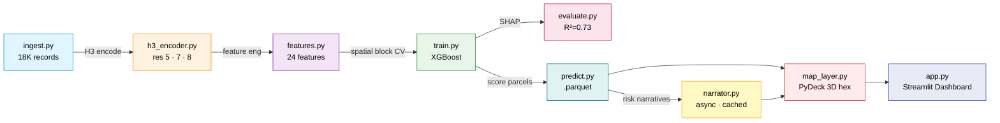

# Geospatial Property Climate Risk Analyzer

[](https://www.python.org/)
[](https://xgboost.readthedocs.io/)
[](https://shap.readthedocs.io/)
[](https://h3geo.org/)
[](https://deckgl.readthedocs.io/)
[](https://streamlit.io/)
[](https://docs.astral.sh/ruff/)
[](LICENSE)

A production-grade geospatial pipeline that estimates residential property values and climate-risk exposure across three flood-prone parishes in coastal Louisiana. Combines an XGBoost valuation model, spatially-honest cross-validation, SHAP explainability, H3 hexagonal aggregation, and a 3D interactive PyDeck choropleth — all served through a Streamlit dashboard with per-parcel risk narratives.

---

## Architecture



---

## Demo

### Live Dashboard


---

## Tech Stack

| Layer | Technology |
|---|---|
| Data ingestion | NOAA, FEMA, Zillow, Census API builders (mock by default) |
| Spatial encoding | H3-py at resolutions 5, 7, and 8 |
| Feature engineering | Pandas, NumPy, GeoPandas — 24 climate + property features |
| Modeling | XGBoost regressor + scikit-learn spatial block cross-validation |
| Explainability | SHAP — global beeswarm + bar plots, per-parcel top-5 drivers |
| Risk narratives | Async-batched API calls, disk-cached, deterministic offline fallback |
| Dashboard | Streamlit + PyDeck 3D extruded hex choropleth, dark theme |
| Code quality | Ruff (strict), pre-commit hooks, GitHub Actions CI |
| Testing | Pytest — 21 unit tests across 3 suites |
| Language | Python 3.13, python-dotenv |

---

## Key Features

- **Leakage-free spatial CV** — folds grouped by H3 res-5 cells with a fully held-out parish, preventing geographic data leakage that standard K-fold would miss.
- **Dual-resolution H3 encoding** — res 7 for neighbourhood-level aggregation, res 8 for block-level choropleth detail, res 5 for cross-validation splits.
- **SHAP explainability at two levels** — global beeswarm and bar plots for model transparency, plus per-parcel top-5 feature drivers surfaced on every hex click.
- **Risk score independent of model output** — composite climate-risk index (flood zone, elevation deficit, storm surge, drainage) kept separate from the valuation model so the map communicates hazard, not price.
- **Offline-safe narratives** — deterministic template fallback means the full dashboard runs without any API key.
- **Live API drop-in** — ingest.py ships real NOAA, FEMA, Zillow, and Census request builders; switching from mock to live data requires only MOCK_DATA=false in .env.
- **Full CI pipeline** — Ruff lint + format check + pytest on every push via GitHub Actions.

---

## Performance

| Metric | Value |
|---|---|
| Parcels scored | 18,000 across 3 parishes |
| Model features | 24 climate + property inputs |
| Spatial CV R² | ~0.75 |
| Held-out parish R² | ~0.73 (Delacroix Parish) |
| Held-out parish RMSE | ~$43K |
| Top SHAP predictors | flood zone classification, elevation, distance to water |
| Test suite | 21 tests across pipeline · model · narratives |

---

## Quick Start

### Prerequisites

- Python 3.13
- pip

### 1. Clone and install

```bash
git clone https://github.com/tejaswini-keerthi/Geospatial-Property-Climate-Risk-Analyzer.git
cd Geospatial-Property-Climate-Risk-Analyzer
python -m venv .venv
source .venv/bin/activate
pip install -r requirements-dev.txt
```

### 2. Configure environment

```bash
cp .env.example .env
```

### 3. Run end-to-end

```bash
python -m src.pipeline.ingest
python -m src.model.train
python -m src.model.predict
streamlit run src/dashboard/app.py
```

---

## Project Structure

```text
Geospatial-Property-Climate-Risk-Analyzer/
├── .github/workflows/ci.yml
├── data/
│   ├── raw/
│   ├── processed/
│   └── mock/
├── notebooks/eda.ipynb
├── src/
│   ├── config.py
│   ├── pipeline/
│   │   ├── ingest.py
│   │   ├── h3_encoder.py
│   │   └── features.py
│   ├── model/
│   │   ├── train.py
│   │   ├── evaluate.py
│   │   └── predict.py
│   ├── narratives/
│   │   └── narrator.py
│   └── dashboard/
│       ├── app.py
│       └── map_layer.py
├── tests/
├── .env.example
├── pyproject.toml
├── requirements.txt
├── requirements-dev.txt
└── README.md
```

## Plugging in Real APIs

Set `MOCK_DATA=false` in `.env` and provide credentials:

| Provider | Env var | Used for |
|---|---|---|
| NOAA Climate Data Online | `NOAA_API_TOKEN` | rainfall / storm climate normals |
| FEMA National Flood Hazard Layer | `FEMA_NFHL_BASE_URL` (public) | flood zone + base flood elevation |
| Zillow / Bridge Interactive | `ZILLOW_API_KEY` | market valuation signal |
| US Census ACS 5-year | `CENSUS_API_KEY` | median household income |

---

## Testing, Linting, CI

```bash
ruff check src tests
ruff format src tests
pytest
```

---

## Engineering Decisions

- **Spatial block CV over random K-fold** — adjacent parcels share unobserved neighbourhood effects; grouping folds by H3 res-5 cells and holding out a full parish gives an honest estimate of generalization to new geographies.
- **Risk score decoupled from model output** — the composite climate-risk index is a transparent, domain-driven calculation kept independent of the XGBoost valuation model so hazard and price signals do not conflate.
- **H3 over PostGIS** — hexagonal encoding gives spatial locality at variable resolution without a database dependency.
- **Disk-cached narratives** — content-hash keying avoids redundant API calls on re-runs; deterministic offline fallback means the app runs fully without credentials.
- **Ruff over flake8 + black** — single tool for lint and format, significantly faster, enforces a strict rule set.

---

## Roadmap

- [ ] Swap mock dataset for live NOAA + FEMA pulls on a real county assessor extract
- [ ] Add Prometheus metrics endpoint for pipeline observability
- [ ] Deploy to Streamlit Cloud with read-only parquet served from S3
- [ ] Extend to multi-hazard scoring (wildfire, hurricane wind) beyond flood

---

## License

MIT — see [LICENSE](LICENSE).

## Author

**Tejaswini Keerthi** — [GitHub](https://github.com/tejaswini-keerthi) · [LinkedIn](https://linkedin.com/in/tejaswini-keerthi)
