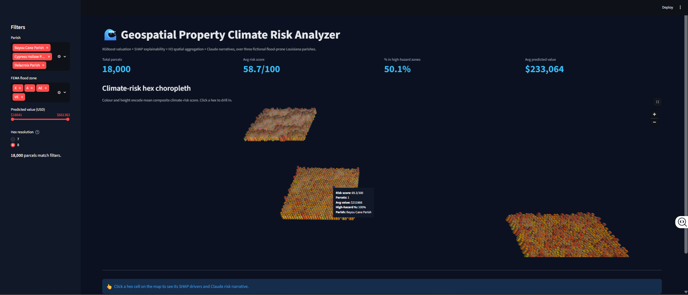

# 🌊 Geospatial Property Climate Risk Analyzer

An end-to-end, production-grade pipeline that estimates residential property values and
their climate-risk exposure across three fictional flood-prone parishes in coastal
Louisiana. It combines gradient-boosted valuation, spatially-honest cross-validation,
SHAP explainability, H3 hexagonal aggregation, a 3D interactive PyDeck map, and
plain-language risk narratives generated by the Claude API.

> **Data note:** the dataset is fully synthetic (18,000 records) but internally
> consistent and physically plausible. It is generated deterministically by
> `python -m src.pipeline.ingest` (not committed to the repo). The ingestion layer also
> ships real NOAA / FEMA / Zillow / Census request builders so the same code path works
> against live providers.

---

## Overview

| Capability | Implementation |
|---|---|
| **Valuation model** | XGBoost regressor predicting `property_value_usd` |
| **Leakage-free evaluation** | Spatial block CV on **H3 res-5** cells + a fully held-out parish |
| **Explainability** | SHAP beeswarm + bar plots (global) and per-parcel top-5 drivers (local) |
| **Spatial encoding** | H3 at **res 7** (neighbourhood) and **res 8** (block) for the choropleth |
| **Risk narratives** | Claude `claude-sonnet-4-6`, async-batched, disk-cached, offline fallback |
| **Dashboard** | Streamlit + PyDeck 3D hex choropleth with drill-down |

### Headline metrics (held-out parish: *Delacroix Parish*)

| Metric | Spatial block CV | Held-out parish |
|---|---|---|
| R² | ~0.75 | **~0.73** (target band 0.72–0.76) |
| RMSE | ~$40k | ~$43k |

Metrics are reproducible from the fixed random seed; see `data/processed/model_meta.json`
after training.

---

## Architecture

```
                         ┌───────────────────────────────────────────┐
                         │                 .env / config              │
                         │   MOCK_DATA · ANTHROPIC_API_KEY · paths     │
                         └───────────────────────┬─────────────────────┘
                                                 │
      ┌──────────────────────────────────────────▼──────────────────────────────────┐
      │                              src/pipeline                                     │
      │                                                                              │
      │   ingest.py            h3_encoder.py               features.py               │
      │  ┌──────────┐         ┌───────────────┐          ┌────────────────────────┐  │
      │  │ mock gen │         │ res 5 (CV)    │          │ derived feats +         │  │
      │  │   OR     │────────▶│ res 7 (map)   │─────────▶│ one-hot + risk score    │  │
      │  │ NOAA/FEMA│         │ res 8 (map)   │          │                         │  │
      │  │ Zillow/  │         └───────────────┘          └───────────┬────────────┘  │
      │  │ Census   │                                                 │               │
      │  └──────────┘                                                 │               │
      └──────────────────────────────────────────────────────────────┼───────────────┘
                                                                      │
      ┌────────────────────────────────────────────────────────────────▼─────────────┐
      │                                src/model                                       │
      │   train.py  ── spatial block CV + held-out parish ── evaluate.py (SHAP)         │
      │        │                                                                        │
      │        ▼                                                                        │
      │   model.json  +  model_meta.json  ── predict.py ──▶ scored_properties.parquet   │
      └────────────────────────────────────────────────────────────┬──────────────────┘
                                                                    │
             ┌───────────────────────────────┐                     │
             │        src/narratives          │                     │
             │  claude_narrator.py            │◀────────────────────┤
             │  (async batch · cache · Claude)│                     │
             └───────────────┬────────────────┘                    │
                             │                                      │
      ┌──────────────────────▼──────────────────────────────────────▼──────────────────┐
      │                              src/dashboard                                       │
      │   app.py (Streamlit)  ──  map_layer.py (PyDeck 3D hex choropleth, dark theme)     │
      │   filters · aggregate metrics · click-to-drill SHAP + narrative                  │
      └─────────────────────────────────────────────────────────────────────────────────┘
```

---

## Project structure

```
Geospatial-Property-Climate-Risk-Analyzer/
├── .github/workflows/ci.yml       # Ruff lint + format + pytest on every push
├── data/{raw,processed,mock}/     # raw inputs · artifacts · bundled mock CSV
├── notebooks/eda.ipynb            # exploratory data analysis
├── src/
│   ├── config.py                  # env-driven settings + logging
│   ├── pipeline/                  # ingest · h3_encoder · features
│   ├── model/                     # train · evaluate (SHAP) · predict
│   ├── narratives/                # claude_narrator (async + cache + fallback)
│   └── dashboard/                 # app (Streamlit) · map_layer (PyDeck)
├── tests/                         # pytest suites (pipeline · model · narratives)
├── .env.example · pyproject.toml · requirements*.txt · .pre-commit-config.yaml
└── README.md
```

---

## Setup

Requires **Python 3.13**.

```bash
# 1. Create and activate a virtual environment
python -m venv .venv
source .venv/bin/activate        # Windows: .venv\Scripts\activate

# 2. Install dependencies
pip install -r requirements-dev.txt   # runtime + lint/test/hooks

# 3. Configure environment
cp .env.example .env                  # Windows: copy .env.example .env
#   MOCK_DATA=true works out of the box (no keys needed).
#   Add ANTHROPIC_API_KEY to enable live Claude narratives.

# 4. (optional) install git hooks
pre-commit install
```

---

## Run it end-to-end (mock data)

```bash
# 1. Generate the 18k-record mock dataset  ->  data/mock/properties.csv
python -m src.pipeline.ingest

# 2. Train, spatially cross-validate, and write SHAP plots + model.json
python -m src.model.train

# 3. Score every parcel (predictions + per-parcel SHAP)  ->  scored_properties.parquet
python -m src.model.predict

# 4. Launch the dashboard
streamlit run src/dashboard/app.py
```

Then open the local URL Streamlit prints. Use the sidebar to filter by parish, flood
zone, and value; click any hex to see its aggregate stats, top-5 SHAP drivers, and a
Claude-generated climate-risk narrative.

Without an `ANTHROPIC_API_KEY`, narratives fall back to a deterministic template so the
full app still runs offline.

---

## Plugging in real APIs

Set `MOCK_DATA=false` in `.env` and provide the relevant credentials:

| Provider | Env var | Used for |
|---|---|---|
| NOAA Climate Data Online | `NOAA_API_TOKEN` | rainfall / storm climate normals |
| FEMA National Flood Hazard Layer | `FEMA_NFHL_BASE_URL` (public) | flood zone + base flood elevation |
| Zillow / Bridge Interactive | `ZILLOW_API_KEY` | market valuation signal |
| US Census ACS 5-year | `CENSUS_API_KEY` | median household income |

`src/pipeline/ingest.py` implements the exact request construction for each provider
(`fetch_noaa_climate`, `fetch_fema_flood_zone`, `fetch_zillow_valuation`,
`fetch_census_income`). Wire them into `_ingest_from_live_apis()` with your parcel
source (e.g. a county assessor extract) — the downstream H3 / feature / model / dashboard
stages are provider-agnostic and need no changes.

---

## Testing, linting, CI

```bash
ruff check src tests        # lint
ruff format src tests       # format
pytest                      # unit tests (21 tests across 3 suites)
```

GitHub Actions (`.github/workflows/ci.yml`) runs Ruff lint, format check, and pytest on
every push and pull request.

---

## Screenshot

_Dashboard preview — add after first run:_



<!-- Save a screenshot of the running Streamlit app to docs/screenshot.png. -->

---

## Modeling notes

- **Why spatial CV?** Random K-fold leaks geography: adjacent parcels share
  unobserved neighbourhood effects. Grouping folds by H3 res-5 cells (and holding out
  a whole parish) yields an honest estimate of how the model generalizes to *new*
  locations.
- **No leakage features.** County and raw coordinates are deliberately excluded from
  the model matrix so the held-out-parish metric reflects true extrapolation.
- **Risk score ≠ model output.** The composite climate-risk score is a transparent,
  domain-driven index (flood zone, storm surge, elevation deficit, drainage) kept
  independent of the value model, so the map communicates hazard rather than price.

## License

MIT
